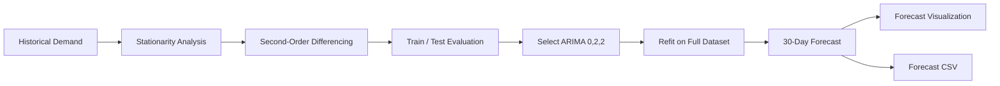
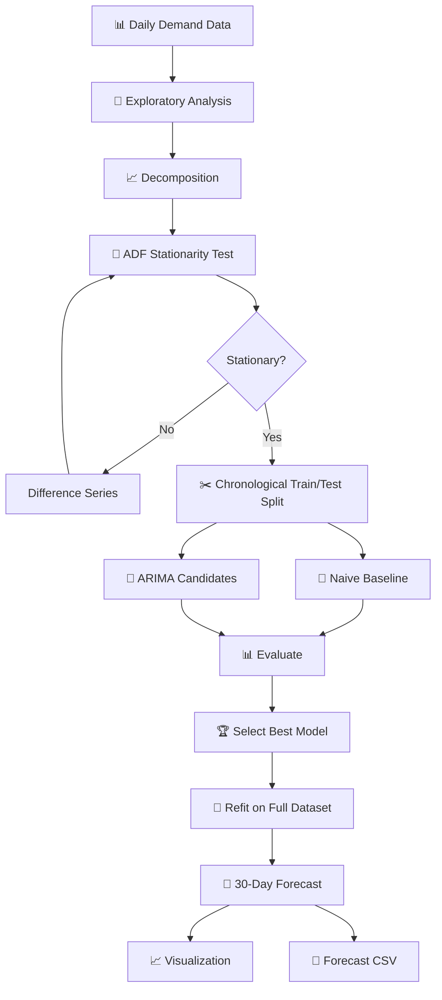

<div align="center">

# ⏳ Time Series Forecasting

### **End-to-End Demand Forecasting with ARIMA / SARIMA**

A statistical time-series forecasting pipeline that analyzes historical demand, evaluates stationarity, compares forecasting approaches against a naive baseline, selects an ARIMA model, and generates a **30-day future demand forecast**.

<br>

[](https://www.python.org/)
[](https://pandas.pydata.org/)
[](https://numpy.org/)
[](https://www.statsmodels.org/)
[](https://scikit-learn.org/)
[](https://jupyter.org/)

<br>

[](https://github.com/Debankumardas/Time-Series-Forecasting)

</div>

---

## 📌 Overview

**Time Series Forecasting** is an end-to-end statistical forecasting project built around a daily demand series.

The project focuses on the complete forecasting workflow rather than simply fitting an ARIMA model:

```text
Historical Demand
       ↓
Exploratory Analysis
       ↓
Trend / Seasonal Analysis
       ↓
Stationarity Testing
       ↓
Differencing
       ↓
Chronological Train / Test Split
       ↓
Naive Baseline
       ↓
ARIMA Model Selection
       ↓
Model Evaluation
       ↓
Final Model
       ↓
30-Day Forecast
```

The selected model, **ARIMA(0,2,2)**, achieved lower test-set RMSE and MAPE than the naive baseline on the available data.

---

# 🎯 Project Objective

The objective is to build a reproducible forecasting workflow that demonstrates how historical time-dependent data can be transformed into statistically validated future predictions.

The project emphasizes:

* Time-series exploration
* Stationarity analysis
* Differencing
* Baseline comparison
* ARIMA model selection
* Chronological validation
* Forecast evaluation
* Future demand prediction

---

# 📊 Dataset

The project uses a daily demand dataset containing:

| Feature           | Description               |
| ----------------- | ------------------------- |
| `date`            | Observation date          |
| `demand`          | Daily demand value        |
| `marketing_event` | Marketing event indicator |
| `holiday`         | Holiday indicator         |

### Dataset size

**30 daily observations**

**Date range:** June 1, 2026 → June 30, 2026.

> ⚠️ Because the available history contains only 30 observations, the project is intended primarily as a **forecasting methodology demonstration**, not a production demand-planning system.

---

# 🔬 Methodology

The forecasting workflow follows a chronological statistical process.

## 1. Exploratory Time-Series Analysis

The historical demand series is inspected to understand:

* Overall movement
* Trend
* Possible seasonality
* Variability
* Temporal patterns

---

## 2. Time-Series Decomposition

The series is decomposed to investigate its underlying components.

```text
Observed Series
      │
      ├── Trend
      │
      ├── Seasonal Component
      │
      └── Residual
```

The resulting decomposition is saved as:

```text
outputs/time_series_decomposition.png
```

---

## 3. Stationarity Testing

The **Augmented Dickey-Fuller (ADF) test** is used to determine whether the demand series is stationary.

### Results

| Series            |    ADF p-value | Interpretation       |
| ----------------- | -------------: | -------------------- |
| Original          |       `0.7867` | Non-stationary       |
| First difference  |       `0.1943` | Still non-stationary |
| Second difference | `6.09 × 10⁻²⁸` | Stationary           |

The second-order differenced series achieved a statistically significant stationarity result, leading to **d = 2** for the evaluated ARIMA candidates.

---

# 🧮 ARIMA Modeling

ARIMA models are evaluated after determining the required degree of differencing.

The general ARIMA formulation is:

```text
ARIMA(p, d, q)
```

where:

* `p` = autoregressive order
* `d` = differencing order
* `q` = moving-average order

For this project:

```text
d = 2
```

Candidate models are evaluated and compared using model-selection criteria and out-of-sample forecasting performance.

---

# 📏 Baseline Comparison

A **naive forecasting model** is used as a baseline.

This is important because a forecasting model should not only produce predictions—it should demonstrate that it improves upon a simple benchmark.

### Test-set performance

| Model            |        RMSE |      MAPE |
| ---------------- | ----------: | --------: |
| Naive Baseline   |     15.2698 |     6.80% |
| **ARIMA(0,2,2)** | **13.2212** | **6.44%** |

### Result

**ARIMA(0,2,2)** achieved the best test-set performance among the evaluated candidates and outperformed the naive baseline on both RMSE and MAPE.

---

# 🏆 Selected Model

## ARIMA(0,2,2)

The selected model is:

```text
p = 0
d = 2
q = 2
```

### Why this model?

The model was selected based on the forecasting workflow and evaluation results rather than choosing a model arbitrarily.

It provided:

* Lower RMSE than the naive baseline
* Lower MAPE than the naive baseline
* A suitable differencing order after stationarity analysis

---

# 🔮 30-Day Forecast

After model evaluation, the selected ARIMA model is refitted using the complete historical dataset.

It is then used to generate a **30-day future demand forecast**.



### Forecast period

The generated forecast begins on:

**July 1, 2026**

and extends for 30 future days.

---

# 📈 Results

The project generates visual and tabular outputs for interpreting the forecasting process.

### Generated outputs

```text
outputs/
├── time_series_decomposition.png
├── 30_day_demand_forecast.png
└── 30_day_demand_forecast.csv
```

### Forecast visualization

The forecast plot provides a visual comparison between the historical demand series and the predicted future values.

### Forecast data

The generated CSV contains the future forecast values for downstream analysis.

---

# 🧠 Forecasting Architecture



---

# 🧪 Evaluation Strategy

Because time-series observations are ordered chronologically, the project avoids random train/test splitting.

Instead:

```text
Past Data
   ↓
Training Set
   ↓
Future Holdout
   ↓
Forecast
   ↓
Compare with Actual Values
```

This prevents future observations from leaking into the training process.

### Metrics

#### RMSE

Root Mean Squared Error penalizes larger forecasting errors more strongly.

```text
RMSE = √ mean((y_actual - y_predicted)²)
```

#### MAPE

Mean Absolute Percentage Error measures average percentage deviation.

```text
MAPE = mean(|(actual - predicted) / actual|) × 100
```

Both metrics are used to compare the forecasting model against the naive baseline.

---

# 🛠️ Tech Stack

| Category            | Technologies        |
| ------------------- | ------------------- |
| **Language**        | Python              |
| **Data Processing** | Pandas, NumPy       |
| **Visualization**   | Matplotlib, Seaborn |
| **Statistics**      | SciPy, Statsmodels  |
| **Forecasting**     | ARIMA               |
| **Evaluation**      | Scikit-learn        |
| **Development**     | Jupyter Notebook    |
| **Version Control** | Git, GitHub         |

---

# 📁 Project Structure

```text
Time-Series-Forecasting/
│
├── data/
│   └── daily-demand-series.csv
│
├── notebooks/
│   └── time_series_forecasting.ipynb
│
├── outputs/
│   ├── time_series_decomposition.png
│   ├── 30_day_demand_forecast.png
│   └── 30_day_demand_forecast.csv
│
├── .gitignore
├── README.md
└── requirements.txt
```

The repository keeps the workflow simple and reproducible:

```text
data → notebook → analysis → outputs
```

---

# ⚙️ Installation

## 1. Clone the repository

```powershell
git clone https://github.com/Debankumardas/Time-Series-Forecasting.git

cd Time-Series-Forecasting
```

## 2. Create a virtual environment

### Windows PowerShell

```powershell
python -m venv .venv
```

Activate it:

```powershell
.venv\Scripts\Activate.ps1
```

## 3. Install dependencies

```powershell
pip install -r requirements.txt
```

---

# ▶️ Run the Project

Open the forecasting notebook:

```text
notebooks/time_series_forecasting.ipynb
```

Then execute the notebook cells sequentially.

The notebook performs:

```text
Load Data
   ↓
EDA
   ↓
Decomposition
   ↓
ADF Testing
   ↓
Differencing
   ↓
Train/Test Split
   ↓
Baseline
   ↓
ARIMA Evaluation
   ↓
Final Model
   ↓
30-Day Forecast
   ↓
Save Outputs
```

---

# 📌 Key Findings

### Stationarity

The original demand series was non-stationary.

```text
ADF p-value = 0.7867
```

First-order differencing was not sufficient:

```text
ADF p-value = 0.1943
```

Second-order differencing produced a stationary series:

```text
ADF p-value = 6.09 × 10⁻²⁸
```

### Model performance

The selected **ARIMA(0,2,2)** model improved upon the naive baseline:

```text
RMSE
15.2698 → 13.2212

MAPE
6.80% → 6.44%
```

These results are based on the current dataset and test split.

---

# ⚠️ Limitations

This project intentionally documents its limitations.

### 1. Limited historical data

The dataset contains only **30 observations**.

This is not enough to reliably establish long-term seasonal patterns or support robust long-horizon business forecasting.

### 2. External variables are not modeled

Although the dataset contains:

* `marketing_event`
* `holiday`

the current ARIMA model does **not** explicitly use these variables as external regressors.

### 3. Forecast horizon

A 30-day forecast from only 30 historical observations should be interpreted cautiously.

### 4. Demonstration rather than production

The current implementation is best viewed as a **demonstration of a complete statistical forecasting workflow**, rather than a production-ready demand forecasting system.

---

# 🚀 Future Improvements

The next stage of the project could focus on improving both the data and modeling strategy.

### Data

* Expand the historical dataset
* Add multiple seasonal cycles
* Include real-world demand data
* Incorporate external variables

### Modeling

* SARIMA with explicit seasonal parameters
* ARIMAX with external regressors
* Prophet
* Exponential Smoothing
* Gradient boosting models
* LSTM / deep learning approaches
* Automated hyperparameter selection

### Evaluation

* Rolling-origin validation
* Walk-forward forecasting
* Confidence intervals
* Multi-horizon evaluation
* Model comparison dashboard

---

# 💡 Why This Project Matters

Forecasting is not simply about selecting a sophisticated model.

A reliable forecasting workflow requires:

```text
Understand the Series
        ↓
Test Assumptions
        ↓
Transform When Necessary
        ↓
Build a Baseline
        ↓
Train Candidate Models
        ↓
Evaluate on Future Data
        ↓
Select the Model
        ↓
Forecast
        ↓
Understand Limitations
```

This project demonstrates that complete process using a reproducible statistical workflow.

---

# 🎓 Skills Demonstrated

### Data Science

* Exploratory data analysis
* Time-series visualization
* Data transformation
* Feature interpretation

### Statistics

* Stationarity testing
* ADF test
* Differencing
* Statistical model selection
* Forecast error analysis

### Machine Learning

* Chronological validation
* Baseline modeling
* Model comparison
* RMSE / MAPE evaluation

### Python

* Pandas
* NumPy
* Statsmodels
* Scikit-learn
* Matplotlib
* Seaborn
* Jupyter

---

# 👨‍💻 Author

## Deban Kumar Das D

**Data Science · Machine Learning · Artificial Intelligence**

I build practical data science and AI projects focused on statistical analysis, machine learning, forecasting and intelligent applications.

### Connect

[](https://github.com/Debankumardas)

[](https://www.linkedin.com/in/debankumardasd/)

---

<div align="center">

### ⭐ If you find this project useful, consider starring the repository.

**Analyze · Model · Forecast · Evaluate**

</div>
